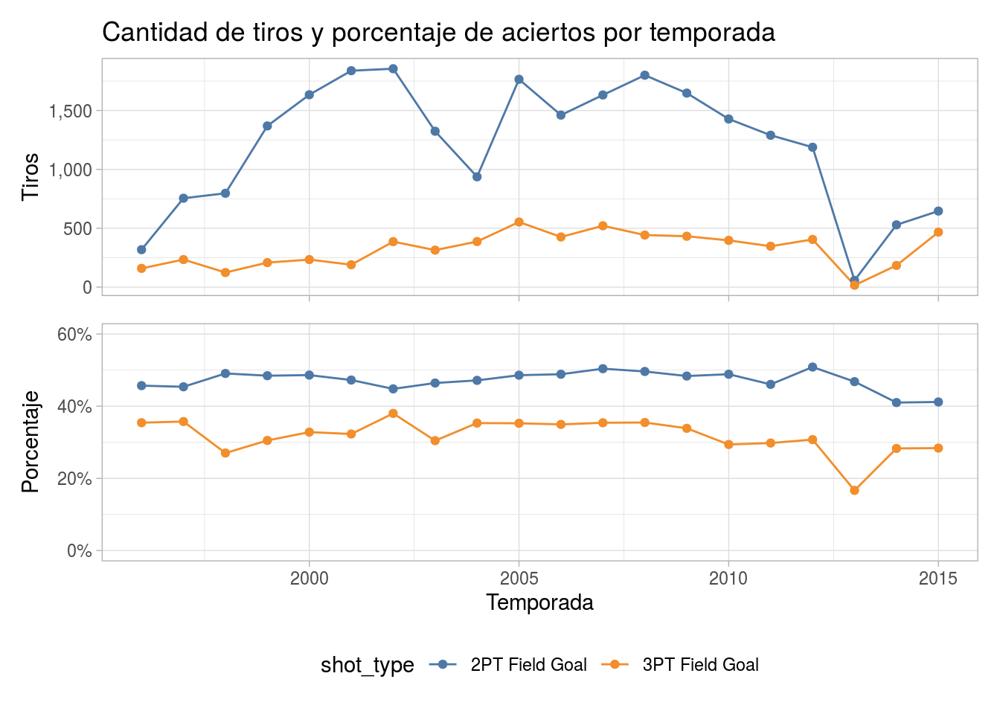
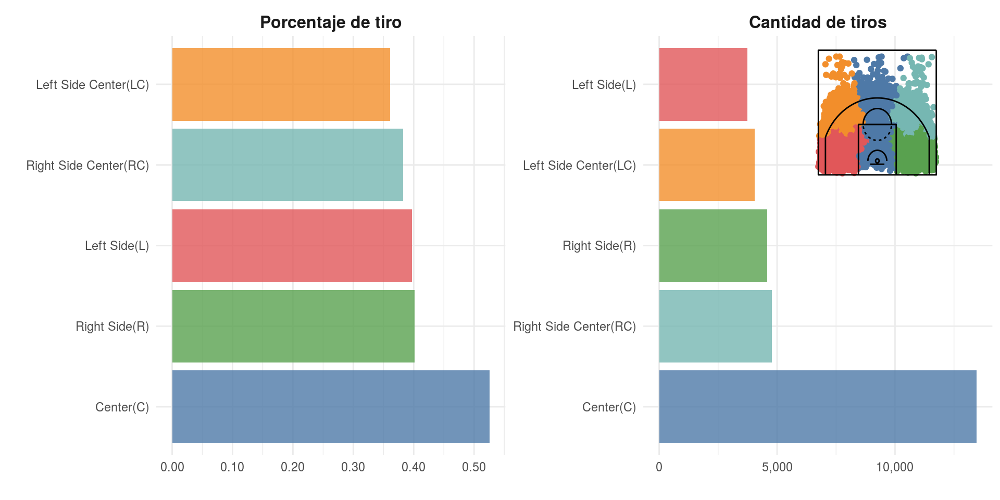
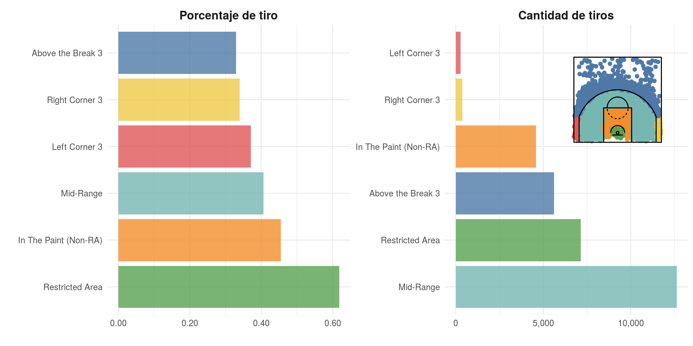
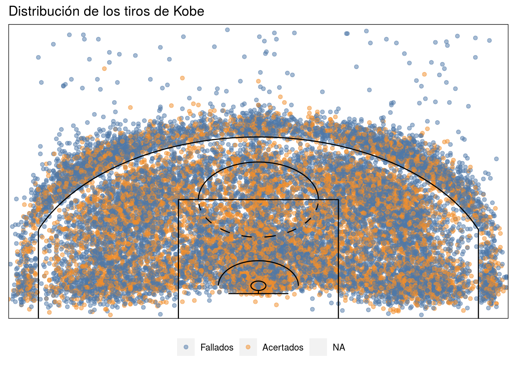
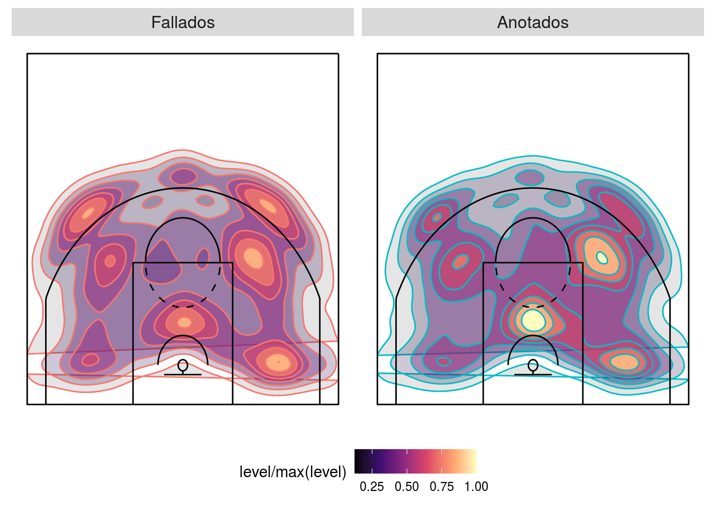
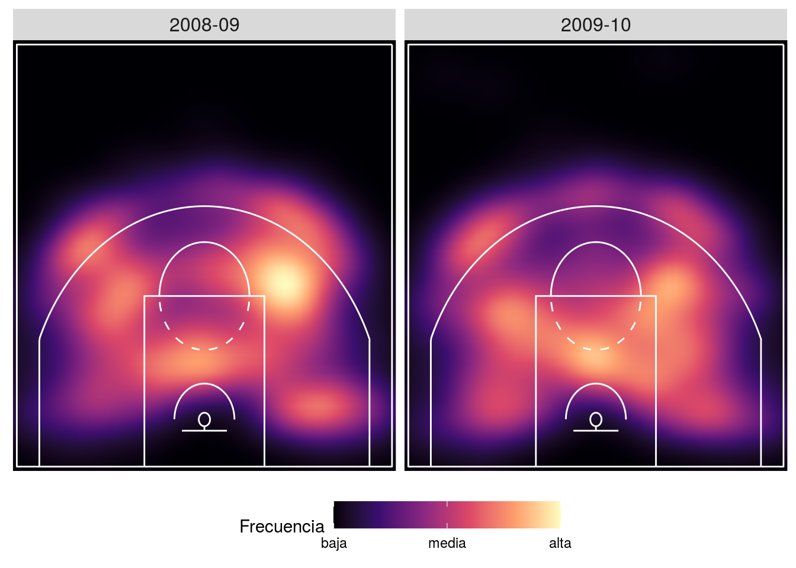
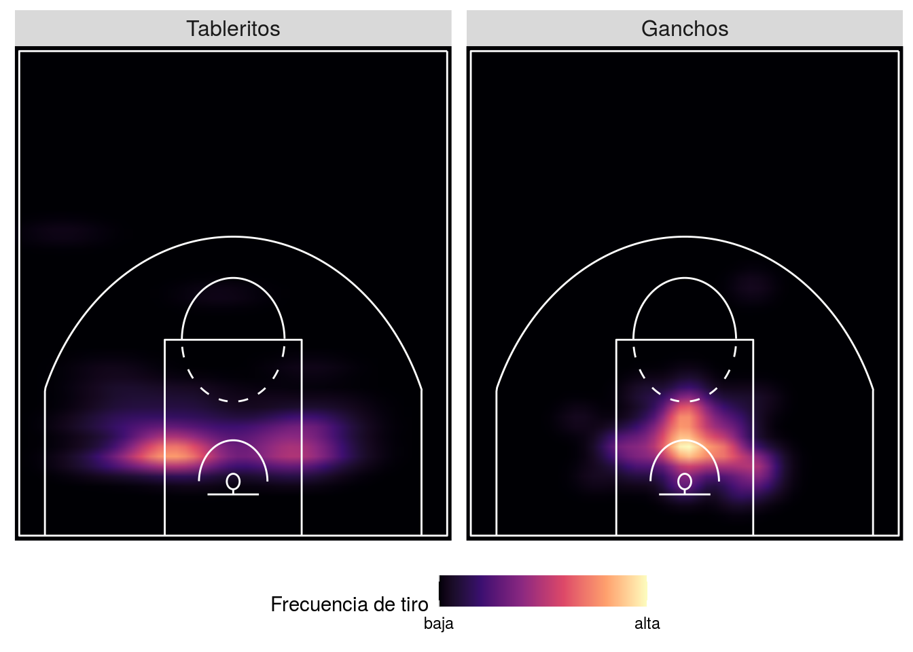
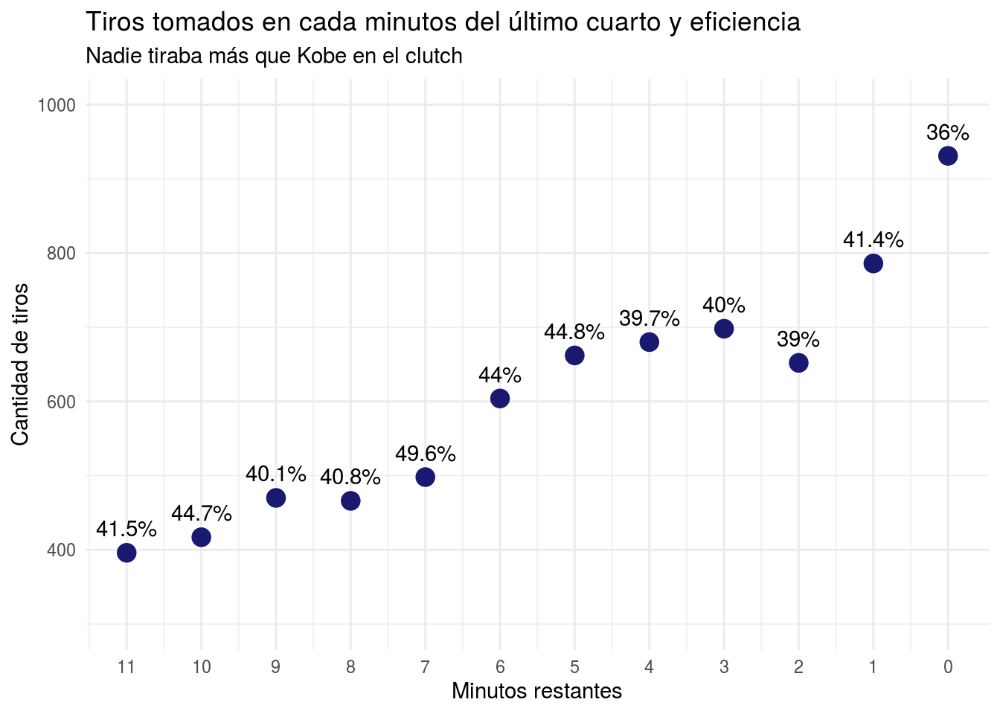

Tras el fallecimiento de Kobe Bryant me comprometí a postear una serie de entradas relacionadas a él. En esta oportunidad haremos un análisis exploratorio de Kobe Bryant desde la optica de los tiros que tomó en sus 20 años de carrera profesional.

La data que utilizaremos para este análisis tiene la ubicación de cada tiro tomado por Kobe, resultando muy interesante y tentadora para hacer valoraciones y críticas, pero la verdad es que tiene limitaciones para comprender lo legendario de cada tiro tomado por Kobe Bryant.

Las limitaciones que tiene los registros de tiro para hacer valoraciones profundas sobre la selección de tiro de un jugador son muchas, así que voy a resaltar algunas para justificar las razones por las que no haré valoraciones, además de mi condición de fanático e inexperto. 

Limitaciones:

- No hay detalles de la defensa. No sabemos a qué distancia estaba el defensor más cercano, cuantos defensores había, quienes estaba defendiendo (Hay defensores más hábiles que otros)
- No hay detalles que los malabares que hizo para llegar a determinada posición. 
- Esta data puede conducir a interpretaciones burdas, alguien podría concluir que como debajo del aro la eficiencia de tiro de un jugador es mayor, pues debería tomar más tiros de esa zona, cuando en realidad llegar a esa zona es bastante complicado e quizás incremente mucho la posibilidad de pérdidas de balón.
- No hay detalles de la posición de los compañeros en la cancha, ni de quienes eran. No podemos decir si había una opción de tiro mejor (Difícil que haya una opción mejor a que kobe la tire). 

Por estas razones me limitaré a ser completamente descriptivo en este post, además de equilibrar adecuadamente la interpretación de las visualizaciones y los comentarios sobre los detalles y estrategias utilizadas para generarlas. Esto para no aburrir a los que entren a leer sin interés muy profundo en el código, o viceversa.

## Para reproducir el contenido

### Repositorios de archivos 
Como de costumbre, compartiré el enlace al repositorio en github de la publicación, pero esta vez y quizás en las próximas ocasiones, compartiré también el enlace del proyecto en rstudio.cloud. Esta segunda opción garantiza la reproducción de todo el contenido, al poner una sección de R en el navegador, con todos los paquetes y archivos utilizados para crear el material. 

- [Proyecto en rstudio.cloud](https://rstudio.cloud/project/1010634)
- [Repositorio en github]()

Por otro lado, para lograr visualizaciones llamativas intenté varias opciones para incorporar los segmentos de la cancha en los gráficos. El primer intento fue colocar una imagen de fondo en los gráficos, pero no lograba ajustar bien las dimensiones y quedaba feo. El segundo intento consistió dibujar las líneas con ggplot2. Para lograr esto me auxilié del código de varias personas, principalmente el de [Todd Wschneider]() que a su vez se basó en las publicaciones de [Savvas Tjortjoglou](http://savvastjortjoglou.com/nba-shot-sharts.html) (por eso amo mundo open source). Menciono esto porque las adaptaciones que le hice a lo que ellos hicieron fueron extensas y por si solas representarían una publicación individual, pero igual pueden acceder a todos los objetos desde el workspace en el repositorio en gitbub.

## La data 

La data para este análisis es una publicada en [kaggle](https://www.kaggle.com/) para una competencia de machine learning. El objetivo de la competencia es utilizar un set de los tiros tomados por Kobe y construir un modelo que clasifique si una serie de observaciones, para las cuales no tenemos el resultado, fueron encestados o no. 

Entre las variables que constituyen el set de datos se encuentran las siguientes:

- Ubicación del tiro, con coordenadas en escala a las dimensiones de una chancha de basket.
- Zona del tiro
- Distancia respecto al aro
- Tiempo restante del cuarto
- Tipo de tiro (tablerito, gancho, donqueo, jump shot)
- Id del juego
- Equipo contrincante
- Si el tiro se tomó en playoff o serie regular
- Fecha del juego
- Resultado del lanzamiento (acierto o fallo)

Aqui [Enlace de la competencia](https://www.kaggle.com/c/kobe-bryant-shot-selection), con los detalles sobre el set de datos, el enlace orginal de descarga y algunos notebooks de gente que ha compartido sus análisis y modelos. Es probable que en unos días yo publique el mío también. 


## Manos a la obra


```r
# Paquetes
library(tidyverse)
library(ggthemes)
library(patchwork)
library(tidytext) # para usar reorder_within() y scale_y_reordered()

# Función para crear los segmentos de la chancha
# Esta función fue creada en base al trabajo de Todd Wschneider
source("scripts/court_plot.R")

# Importando la data 
shots_data <- read_csv("data.csv") %>% 
  # Unas simples transformaciones a las coordenadas de los tiros
  # para que sean congruente con la escla de court_points
  mutate(
    loc_x = loc_x/10,
    loc_y = (loc_y + 50)/10
  )

# Puntos de la cancha
court_points <- generate_court_points()
```

La verdad es que kobe tiraba mucho, tomaba tiros muy difíciles con mucha frecuencia y eso lo llevó a marcar un porcentaje de aciertos cuestionable para algunos. En toda su carrea lanzó cerca de 45% de campo, pero aun así se colocó en el top tres de anotadores de la historia de la NBA (Lebron le pasó días antes de su muerte), también deleitó al mundo con una serie de canastos inigualables.

En general y sin considerar lo tiros libres, kobe tomó 30,697 tiros de campo, de los cuales 24,271 fueron intentos de dos puntos (79.1%) y 6,426 fueron intentos detrás de la línea de tres. 


```r
shots_data %>% 
  count(shot_type) %>% 
  janitor::adorn_totals("row")
```

```
##       shot_type     n
##  2PT Field Goal 24271
##  3PT Field Goal  6426
##           Total 30697
```
El primer gráfico muestra la distribución de estos tiros en las diferentes temporadas. Kobe tomó mas de 1,000 tiros en la mayoría de las temporadas que jugó y solo tomó menos de 750 tiros en los años de novato y en los años tras la lesión del tendón de Aquiles.


```r
# Gráfico de la cantidad de tiros
p1 <- shots_data %>%
  group_by(season = parse_number(season), shot_type) %>% 
  summarise(fg_percent = mean(shot_made_flag, na.rm = TRUE),
            tiros = n()) %>% 
  ggplot(aes(x = season, y = tiros, color = shot_type)) +
  geom_line() +
  geom_point() +
  scale_y_continuous(labels = scales::comma) +
  theme_light() +
  scale_color_tableau() +
  theme(
    legend.position = "none",
    axis.text.x = element_blank(),
    axis.title.x = element_blank()
  ) +
  labs(
    x = "",
    y = "Tiros",
    title = "Cantidad de tiros y porcentaje de aciertos por temporada"
  )

# Gráfico del porcentaje de campo
p2 <- shots_data %>%
  group_by(season = parse_number(season), shot_type) %>% 
  summarise(
    fg_percent = mean(shot_made_flag, na.rm = TRUE),
    tiros = n()
    ) %>% 
  ggplot(aes(x = season, y = fg_percent, color = shot_type)) +
  geom_line() +
  geom_point() +
  scale_y_continuous(labels = scales::percent) +
  coord_cartesian(ylim = c(0, 0.60)) +
  theme_light() +
  scale_color_tableau() +
  theme(
    legend.position = "bottom"
  ) +
  labs(x = "Temporada", y = "Porcentaje")
  
p1 / p2
```


Las siguientes visualizaciones exploran los tiros tomados por Kobe pero enfocándose en la posición de la cancha en la que los tomó. Indudablemente el  lugar del tiro influye mucho en la probabilidad de acierto, muchas veces los tiros más alejados suelen fallarse más, o los del lado opuesto a la mano dominante, ect. El set de datos trae 2 variables categóricas con la posición de la cancha en la que se tomó el tiro, por tanto, podemos ver la cantidad y el porcentaje de acierto en cada zona.

Estos gráficos introducen dos cuestiones novedosas:

1. Usan la función `reorder_within()` del paquete `{tidytext}`, creado por Julia Silge y  David Robinson, que permite tener gráficos en facets con ejes organizados independientemente.

2. Usar todo un gráfico como anotación en otro gráfico. Esto puede tener una gran variedad de usos, pero en este caso se utiliza para colocar una leyenda interesante al gráfico. De esta forma hasta alguien poco familiarizado con las dimensiones de una chancha entendería a qué área se refiere cada barra.


```r
# Gráfico que funguirá como leyenda
shot_zone2 <- shots_data %>% 
  # excluyendo los tiros antes de cruzar la media chancha
  filter(shot_zone_area != "Back Court(BC)") %>% 
  ggplot() +
  geom_point(aes(
    x = loc_x, y = loc_y,
    color = shot_zone_area), show.legend = FALSE) +
  # Agregando las líneas de la chancha
   geom_path(
    data = court_points,
    aes(x = x, y = y, group = desc)
  ) +
  # Tema sin elementos visuales
  theme_void() +
  # Mover la leyenda
  theme(legend.position = "right") +
  # una escala de color bonita
  scale_color_tableau()

# Gráfico de barras con los tiros y porcentaje de tiro por zona
shots_data %>% 
  filter(shot_zone_area != "Back Court(BC)") %>% 
  group_by(shot_zone_area) %>% 
  summarise(
    tiros = n(),
    porcentaje = mean(shot_made_flag, na.rm = TRUE)
  ) %>% 
  # colocando la data en formato largo
  # en el futuro usen pivote_longer
  gather(medida, valor, -shot_zone_area) %>%
  mutate(
    medida = factor(medida, labels = c("Porcentaje de tiro", "Cantidad de tiros"))
  ) %>% 
  ggplot(aes(
    # Creando el factor organizado individualmenet
    x = tidytext::reorder_within(shot_zone_area, by = desc(valor), within = medida),
    y = valor,
    fill = shot_zone_area)
    ) +
  geom_col(show.legend = FALSE, alpha = 0.8) +
  facet_wrap(~medida, scales = "free") +
  tidytext::scale_x_reordered() +
  coord_flip() +
  # Agregando el gráfico anterior como anotación
  annotation_custom(ggplotGrob(shot_zone2), xmin = 3.8, xmax = 5.5, ymin = 6500, ymax = 12000) +
  theme_minimal() +
  scale_y_continuous(labels = scales::comma) +
  theme(
    strip.text = element_text(size = 12, face = "bold")
  ) +
  labs(x = "",
       y = "") +
   scale_fill_tableau()
```




```r
shot_zone <- shots_data %>% 
  filter(shot_zone_basic != "Backcourt") %>% 
  ggplot() +
  geom_point(
    aes(x = loc_x, y = loc_y,
        color = shot_zone_basic), show.legend = FALSE
    ) +
   geom_path(
    data = court_points,
    aes(x = x, y = y, group = desc)
  ) +
  theme(
    axis.text = 
  ) +
  theme_void() +
  theme(legend.position = "right") +
  labs() +
   scale_color_tableau()


shots_data %>% 
  filter(shot_zone_basic != "Backcourt") %>% 
  group_by(shot_zone_basic) %>% 
  summarise(
    tiros = n(),
    porcentaje = mean(shot_made_flag, na.rm = TRUE)
  ) %>% 
  gather(medida, valor, -shot_zone_basic) %>%
  mutate(
    medida = factor(medida, labels = c("Porcentaje de tiro", "Cantidad de tiros"))
  ) %>% 
  ggplot(aes(
    x = tidytext::reorder_within(shot_zone_basic, desc(valor), medida),
    y = valor,
    fill = shot_zone_basic)) +
  geom_col(show.legend = FALSE, alpha = 0.8) +
  facet_wrap(~medida, scales = "free") +
  tidytext::scale_x_reordered() +
  coord_flip() +
  annotation_custom(
    ggplotGrob(shot_zone),
    xmin = 4, xmax = 6,
    ymin = 6500, ymax = 12000
    ) +
  theme_minimal() +
  scale_y_continuous(labels = scales::comma) +
  theme(
    strip.text = element_text(size = 12, face = "bold")
  ) +
  labs(x = "",
       y = "") +
   scale_fill_tableau()
```



Sin duda la data categórica es interesante, pero creo que resulta más emocionante ver un gráfico de los tiros individuales. Igual, al estar hablando de más de 30,000 puntos, un poco de overlap no debería sorprender. Hay que buscar estrategias para lidear con esto, porque en general el gráfico de puntos no deja ver mucho sobre las zonas en las que kobe era más efectivo o, simplemente, tiraba más. 


```r
shots_data %>% 
  filter(shot_zone_basic != "Backcourt") %>% 
  ggplot(aes(x = loc_x, y = loc_y )) +
  geom_point(alpha = 0.5, aes(color = factor(shot_made_flag))) +
  geom_path(
    data = court_points,
    aes(x = x, y = y, group = desc)
  ) +
  scale_color_tableau(labels = c("Fallados", "Acertados")) +
  theme(
    axis.text = element_blank(),
    axis.title = element_blank(),
    panel.grid = element_blank(),
    axis.ticks = element_blank(),
    panel.background = element_blank(),
    legend.position = "bottom"
  ) + 
  labs(color = "") +
  coord_cartesian(expand = FALSE) +
  ggtitle("Distribución de los tiros de Kobe")
```



Hay distintas estrategias para lidiar con overplotting. Entre las más comunes está diminuir la transparencia de los puntos y esperar que las zonas de mayor concentración queden con un color más oscuro. Por otro lado se puede utilizar una geometría especial como  `hexbin::geom_hex()` que crea una especie de histograma bidimensional, en el que divide el espacio en binds hexagonales y cada uno toma color en función a la cantidad de puntos que cae en cada uno. 

Las geometría de densidad bidimensional son otra opción para lidiar con este "problema". Estas facilitan mucho la interpretación porque agrupan las observaciones, en "circulos" con similar cantidad de puntos, de modo los circulos más pequeños tienen mayor densidad. También son una forma de representar en dos dimensiones algo que podría verse en tres.

Aquí se muestran tanto la versión en 2d como la versión 3d. Ahora es más fácil ver de donde metía y fallaba más Kobe. 

Para más ejemplos de como lidiar con overplotting pueden consultar las siguientes fuentes: [from data to viz](https://www.data-to-viz.com/caveat/overplotting.html) y [R graph gallery], ambas creaciones de [Yan Holtz](https://github.com/holtzy).


```r
shots_data %>%
  filter(!is.na(shot_made_flag)) %>% 
  filter(combined_shot_type == "Jump Shot", shot_zone_basic != "Backcourt") %>% 
  mutate(shot_made_flag = factor(shot_made_flag, labels = c("Fallados", "Anotados"))) %>% 
  ggplot() +
        stat_density2d(
          geom = 'polygon',
          contour = T,
          n = 100,
          aes(x = loc_x,
              y = loc_y,
              color = shot_made_flag,
              fill = ..level../max(..level..),
              alpha = ..level..)
          ) +
  geom_path(
    data = court_points,
    aes(x = x, y = y, group = desc)
  ) +
  guides(alpha = FALSE, color = FALSE) +
  facet_wrap(~shot_made_flag) +
  theme(
    axis.text = element_blank(),
    axis.title = element_blank(),
    panel.grid = element_blank(),
    axis.ticks = element_blank(),
    panel.background = element_blank(),
    strip.text = element_text(size = 12),
    legend.position = "bottom"
  ) + 
  scale_fill_viridis_c(option = "magma")
```



Grafíco 3D de la distribución de tiros.


```r
kd_shots <- with(
  subset(shots_data, action_type == "Jump Shot" & shot_made_flag == 1),
  MASS::kde2d(loc_x, loc_y, n = 30)
  )

plotly::plot_ly(x = kd_shots$x, y = kd_shots$y, z = kd_shots$z) %>% plotly::add_surface()
```

<!--html_preserve--><div id="htmlwidget-e76f2e02987ad4b04753" style="width:672px;height:480px;" class="plotly html-widget"></div>
<script type="application/json" data-for="htmlwidget-e76f2e02987ad4b04753">{"x":{"visdat":{"8364e7fb7c6":["function () ","plotlyVisDat"]},"cur_data":"8364e7fb7c6","attrs":{"8364e7fb7c6":{"x":[-24.5,-22.8,-21.1,-19.4,-17.7,-16,-14.3,-12.6,-10.9,-9.2,-7.5,-5.8,-4.1,-2.4,-0.699999999999999,1,2.7,4.4,6.1,7.8,9.5,11.2,12.9,14.6,16.3,18,19.7,21.4,23.1,24.8],"y":[1.2,2.82068965517241,4.44137931034483,6.06206896551724,7.68275862068965,9.30344827586207,10.9241379310345,12.5448275862069,14.1655172413793,15.7862068965517,17.4068965517241,19.0275862068966,20.648275862069,22.2689655172414,23.8896551724138,25.5103448275862,27.1310344827586,28.751724137931,30.3724137931034,31.9931034482759,33.6137931034483,35.2344827586207,36.8551724137931,38.4758620689655,40.0965517241379,41.7172413793103,43.3379310344828,44.9586206896552,46.5793103448276,48.2],"z":[[5.09841996708734e-05,0.000166199189059111,0.000312988576287788,0.000345767755997954,0.000258124751489045,0.000191563905043208,0.000181407603312722,0.000153092731654369,0.000140535172168218,0.000166953326167678,0.000198730730316051,0.000200777680119884,0.00016044231894426,0.000106686095043698,6.50246653890899e-05,3.36863777465554e-05,1.24548556378037e-05,2.83622412406756e-06,4.45669846795863e-07,4.69278253365472e-08,2.2392705963418e-09,1.2710542040849e-10,1.43310932544334e-09,7.27771424722753e-09,1.13729337162583e-08,5.4679692699173e-09,8.08826905181074e-10,3.68095979220866e-11,5.1539774665868e-13,2.22023995682606e-15],[7.15921063760133e-05,0.000229932369443278,0.000428536634659028,0.000480400928131285,0.000374724005557437,0.000288685481676486,0.000279666672569057,0.000256970571240408,0.000245502120705396,0.000286366335322019,0.000359136150913031,0.000406022389571579,0.00037927854674684,0.000303665026597967,0.000214939205016394,0.000122066661153243,4.92051636321001e-05,1.28844719217573e-05,2.41236442582706e-06,2.80040172764535e-07,1.44742804148494e-08,1.10539687732976e-09,1.32791241022193e-08,6.74339303524689e-08,1.05379361498535e-07,5.06651119579805e-08,7.49442802643656e-09,3.41070348292865e-10,4.77557205626835e-12,2.05722976669215e-14],[8.13226055237456e-05,0.000264199263850437,0.000493005458514732,0.000558780485196668,0.000459145746748281,0.000371264172878379,0.000366685801235481,0.000367188167120407,0.000357939378406996,0.000395835451416239,0.000499793132294809,0.000609972938660489,0.000656120060460182,0.00062987779736668,0.000520000941407669,0.000332784124054952,0.000150528106713589,4.54969230385e-05,9.62022720273433e-06,1.20058176081818e-06,6.96867864314993e-08,6.5135943491953e-09,7.77834018702557e-08,3.9493852253886e-07,6.17167955161813e-07,2.96726192901486e-07,4.38919687426019e-08,1.99751674557325e-09,2.79686710748302e-11,1.20483955511569e-13],[8.8370853082518e-05,0.000298291581155164,0.000562215696994087,0.000636671387281012,0.000541842236347908,0.000456131274896414,0.000455299730344861,0.000481171942630461,0.000478398191318113,0.000513759082062434,0.000622109156735584,0.00075167697901087,0.000869730873973327,0.000969883214999098,0.000941722843577082,0.000699592224071767,0.000362044465205432,0.00012480074634005,2.89676764514042e-05,3.95398600698829e-06,2.72350442863731e-07,2.70199206827869e-08,2.88193325995114e-07,1.4620969995532e-06,2.28467660408953e-06,1.09842307885921e-06,1.62478643524927e-07,7.39436354147619e-09,1.0353374290727e-10,4.46004463796175e-13],[0.000101599681517211,0.000351046185777599,0.000661718957610136,0.000735261297228865,0.000626389121682503,0.000547553485503841,0.000550199618268635,0.000583266938555029,0.000601151528809732,0.000670871872584747,0.000782112572815008,0.000867739618172434,0.000960011813153784,0.0011541601423951,0.00131041162422399,0.00114576453597164,0.000682910715282304,0.000267595366375169,6.93867298025813e-05,1.08847801894314e-05,9.3678267414636e-07,9.05205864720011e-08,6.7796740039664e-07,3.42330295468408e-06,5.3467748525355e-06,2.57024494244962e-06,3.8017214711032e-07,1.73012629235056e-08,2.4224597506588e-10,1.04354987869209e-12],[0.000116439621431717,0.000396118929138701,0.000738023340644447,0.000793464080928424,0.000658386575747321,0.000605876782828474,0.000620343009856564,0.000642471531110073,0.000693712256327835,0.000829577245202755,0.000969567920424819,0.00101358000461821,0.0010011468816771,0.0011543581084556,0.00144930251720652,0.00146531665909093,0.00100804484170483,0.00045904883216698,0.000139993069061416,2.65079537981483e-05,2.93756777301406e-06,3.11162878912153e-07,1.03906060233416e-06,5.09061301393132e-06,7.92130314697369e-06,3.80337441930943e-06,5.62346271085845e-07,2.55884432885586e-08,3.58264158632424e-10,1.54336629990176e-12],[0.000119388386298071,0.000394514014864285,0.000730119545110641,0.000756038128241233,0.000594596877756052,0.000576095694387174,0.000612520696933315,0.000630096776788421,0.000713531784684512,0.000901664362210162,0.00108904131456235,0.00116067235545517,0.00108309195230695,0.00110281228772781,0.00134765083714974,0.00148200502494615,0.00117997756340536,0.000650711637241333,0.000244352221429913,5.68092913731535e-05,8.15891016809332e-06,1.15995595637537e-06,1.21662903798854e-06,4.97083833601116e-06,7.51181137816138e-06,3.57254371758401e-06,5.26518688857116e-07,2.39322128732294e-08,3.34956228924366e-10,1.44841433657138e-12],[0.000103343323568884,0.000338451652411479,0.000638598245211762,0.000648999802958315,0.000473079913991987,0.00046482031365592,0.000514566805661614,0.000544904556671468,0.000647758780214577,0.000844357469538208,0.00107477383246416,0.00123612408049193,0.00118744546888867,0.00109416061111174,0.00114659733217104,0.00123637854941243,0.00113360892246793,0.000782690963298421,0.000364941674266313,0.000102851793547347,1.91530947243917e-05,3.89473410956028e-06,1.82475575011084e-06,3.96183867858025e-06,4.95831499812095e-06,2.19464316564771e-06,3.15250950777084e-07,1.42036483855649e-08,1.98404985706027e-10,1.22136843600443e-12],[7.4412947903109e-05,0.000252482331137009,0.000508560272858932,0.000538772451136806,0.000379220382745,0.000355085877410663,0.000395207386024252,0.000437508911043188,0.000543517634967646,0.000714804743041382,0.000964598135828767,0.00121353304359359,0.00123393318018649,0.00108993129520043,0.00096609165671072,0.00092895288688659,0.000948724457948254,0.000816375129417645,0.000462019677710443,0.000155504650503686,3.79354558168127e-05,1.03760208778047e-05,4.00982093948961e-06,4.61765612739786e-06,3.44551542329771e-06,1.07660654052276e-06,1.30498822532086e-07,5.50090561486566e-09,8.32909453540666e-11,1.53840489618051e-11],[4.45383942098504e-05,0.000166859468341176,0.000379791656988537,0.000456402793568166,0.00035457252877122,0.000319848194387544,0.000339656017409062,0.000376919026697393,0.000471362590590355,0.000607837543024661,0.00083918298963368,0.00111409511235237,0.0011785491471683,0.00102579864101356,0.000834528974893826,0.000714106646435692,0.000755051530206814,0.000770171633653125,0.000517760714706153,0.000209054260122344,6.57685541299467e-05,2.11579670163044e-05,7.66423012526366e-06,7.18661196547896e-06,3.90107902718552e-06,7.5199534157493e-07,5.55402888537883e-08,1.71306176641997e-09,2.35349952486687e-10,3.89286290826958e-10],[2.24045354923177e-05,0.00010083269876894,0.000272296177855147,0.000393060044977423,0.000376174803917715,0.000364202732990415,0.000373228648579626,0.000390487060100135,0.000459749084172559,0.000558979423485963,0.000732737789152602,0.000961546860367927,0.00103103054651703,0.000899023645355929,0.000740500352691314,0.000613474294117109,0.000623756486317909,0.000706590594880145,0.000564960438857935,0.000275195933942465,0.000101400176393519,3.28388858436817e-05,1.03501032477665e-05,8.59631734479273e-06,4.36385622355339e-06,7.21762158299973e-07,3.86015161243348e-08,1.31464570003548e-09,3.5305635663395e-09,6.35596579300759e-09],[1.0081300196636e-05,5.89306053030368e-05,0.000190632154306538,0.000332054034233379,0.000401075624167469,0.000450414685774657,0.000472231855722011,0.000466433950607059,0.000495455727458415,0.000546855919953276,0.000646401352802966,0.000796650594758462,0.00085139873453098,0.000763038134189728,0.000679525344404863,0.000584761309054858,0.000554941397662768,0.000666346593043841,0.000637551765777408,0.000363987420718133,0.000137820360668288,3.95320032232809e-05,9.83948275657896e-06,6.73453510608011e-06,3.3404666689149e-06,5.39808385168152e-07,2.7398773410032e-08,6.63552049792661e-09,3.63920398049989e-08,6.56058581188291e-08],[4.76261050564018e-06,3.56264838839012e-05,0.000131516896587518,0.000268050070918341,0.000407192045983937,0.000547521155414738,0.000616480731997213,0.000598122603554866,0.000572759956770694,0.000563380084836927,0.000608122172901869,0.000701526544219638,0.000742548112139618,0.000698011825780193,0.00067647619297628,0.000613053143638001,0.000540217295957049,0.00066062392971974,0.000738230775478727,0.000468974977029549,0.000169217110025374,4.01814752710749e-05,7.36104064388262e-06,3.45554534229012e-06,1.63642380692546e-06,2.63010452283629e-07,1.52041960500027e-08,4.0715984057606e-08,2.37414860018514e-07,4.28024056000109e-07],[3.10674009973522e-06,2.52152306259736e-05,9.52899431254981e-05,0.000213701333590957,0.000404756389884714,0.000648107523400038,0.000788799740328939,0.000771026357985645,0.0006867057499378,0.000613673882763323,0.000641496756627134,0.000728255532356522,0.000766547017656162,0.00074050137751552,0.000744878172290123,0.000697184481449312,0.000579887072253821,0.000696220127446265,0.000850961534251055,0.00057105980215196,0.000197262940125358,4.11929087350739e-05,6.23223564056868e-06,1.40664101577978e-06,5.19479704684399e-07,8.16118893447559e-08,1.28098036278256e-08,1.67135858872131e-07,9.79028630285365e-07,1.76505110831781e-06],[3.54761876323761e-06,2.51956759078944e-05,8.58373407904055e-05,0.000189959801540481,0.000410517126806249,0.000728996063662585,0.000923071247501505,0.000906904108049545,0.000780048107792407,0.000664064624053989,0.000698729362622625,0.000810592663112479,0.000857602136778193,0.000826145873276428,0.000827125608662639,0.000778867144505907,0.000628064083121141,0.00073307426556158,0.000915798742449189,0.000625646328335715,0.000216982236313925,4.70576105563131e-05,7.98505177499796e-06,1.00614996439833e-06,1.35321502777902e-07,1.68413813036427e-08,2.36558139524488e-08,4.35485663305968e-07,2.55180749240863e-06,4.60055175057898e-06],[5.38776995687665e-06,3.33708333714362e-05,0.000103842248651456,0.000209240696509838,0.000423780012967886,0.000743327788575303,0.000934031359176071,0.00091221391177785,0.000784162305718502,0.000673459381123806,0.000712740783329457,0.000837042605846799,0.000898480317554583,0.000865058597535606,0.000848712524907248,0.000780257591775372,0.000614667172102747,0.000703113665055613,0.000866744601643149,0.000592681659402011,0.000214357581272199,5.28517916170907e-05,1.07127801837422e-05,1.29811839644198e-06,7.37567149248047e-08,3.59407198958342e-09,3.77705121999063e-08,7.17428957994818e-07,4.20401310660534e-06,7.57924738126426e-06],[7.74834889020088e-06,4.73495116243325e-05,0.000147564927924835,0.000273152051941028,0.000449679222600943,0.00069506941241929,0.000829708656904017,0.000803014132049213,0.000721688704183282,0.000663371475378589,0.000698555418499533,0.00080985316600023,0.000887838464750241,0.000871557723363612,0.000827667178194382,0.000716247679800114,0.000552183019874349,0.000627171611889264,0.000747187804187112,0.000505919780668783,0.000191186677251019,5.12778949891059e-05,1.10821287151168e-05,1.36889703310671e-06,6.81046348476384e-08,1.91143861984283e-09,3.92372979304738e-08,7.47063912627066e-07,4.37767735074926e-06,7.89233972548859e-06],[1.05040763977932e-05,6.59193991138745e-05,0.000211357443412012,0.000370441619559661,0.000499589225032128,0.000638727343949193,0.000698798059473935,0.000679553546538464,0.000666650769347742,0.000677313231135642,0.000724966994514224,0.000831999129901174,0.000934410523629061,0.000946614050790155,0.000855913517471927,0.000680220954969703,0.000531589022713997,0.000609659846806982,0.000671992422626477,0.000434946467727412,0.000163403643156311,4.20286526628019e-05,8.29541279651687e-06,9.73312148671887e-07,4.71721929250795e-08,1.2207825479258e-09,2.58215928680706e-08,4.91700816811171e-07,2.88128995428939e-06,5.19456262906987e-06],[1.62149911322547e-05,9.14056118785923e-05,0.000285435812307487,0.000475621691910133,0.000554589630902507,0.000593436303953585,0.000594361411140157,0.000592394547815544,0.000632423004764309,0.000709483199644894,0.000824966624733031,0.000976174604874427,0.00111313456249078,0.00114566009780957,0.000979675673612941,0.000727438671255951,0.000619320083583523,0.000716164100649497,0.000680593794873859,0.000389781555374545,0.000133651702193604,2.94658921735775e-05,4.60801359954982e-06,4.65286692680112e-07,2.22412579926279e-08,7.69730980469792e-10,1.07607608335872e-08,2.04554296535342e-07,1.19865364012518e-06,2.1610047882531e-06],[2.96810878620916e-05,0.000131810689027412,0.000368991982759509,0.000573859144137279,0.000592278756982172,0.000551114506733525,0.000522785662139967,0.000537080201193169,0.000602603846853408,0.00074481399029706,0.000988980146022569,0.00123474026222951,0.00139831143059652,0.00141191447313021,0.00114759729061145,0.000845658600980291,0.000825067467136645,0.000922802617129841,0.000720867908920843,0.000337364775228256,9.68703577395666e-05,1.7331757733667e-05,2.00397242627713e-06,1.70260544661045e-07,1.96590287154929e-08,3.49559285411101e-09,3.08216477221357e-09,5.37931665930656e-08,3.15183909165921e-07,5.68232406983486e-07],[5.42416644958136e-05,0.000198635792651157,0.000480920061053088,0.000682472431759639,0.00063345262691288,0.00053441147626625,0.000498792510039864,0.000526571795421864,0.000607111164311781,0.000810754596410675,0.00118969682204954,0.00152523920838546,0.00167394336593754,0.00161113598845563,0.00126853968189279,0.00101231611745008,0.00111356647553891,0.00113415122503738,0.000724443538441668,0.000268414181098335,6.02563995703702e-05,8.35611868076805e-06,7.54294161912317e-07,1.7881332701879e-07,1.15856103971477e-07,2.86647608891141e-08,2.67090527115714e-09,8.99153248950697e-09,5.23842720565955e-08,9.44408306489451e-08],[8.75955843017693e-05,0.000294581128097842,0.000636668537178416,0.000823782948684878,0.000714960205845846,0.000579210695445721,0.000540413784692331,0.000582906557135919,0.000685626387618728,0.000929840761056888,0.00137083320013165,0.00172003509179119,0.00179786327245696,0.00163973926441586,0.00132002628331915,0.00122551319197698,0.00138810540799686,0.00122255570785581,0.000648192822041406,0.000195705008514808,3.4136757845039e-05,3.52393559501e-06,4.95449450426187e-07,7.69760998616463e-07,6.19293262901774e-07,1.54688242732826e-07,1.19397419283672e-08,1.2202980477968e-09,5.50499010268014e-09,9.92104267204964e-09],[0.000121216573571806,0.000399897736991824,0.000812208359088794,0.000986992221588604,0.000841437007801886,0.000684134218661579,0.00063044818885287,0.000685861766606462,0.000814387983503528,0.00105291802911249,0.00144049358084364,0.00171807462792882,0.00171636729205387,0.00153391076301875,0.00137710120839275,0.00145232000096295,0.00150332066858371,0.00110760536689527,0.000494331339961348,0.000127956700138836,1.86939554665507e-05,1.58428524808964e-06,1.04533222666138e-06,2.60403660903845e-06,2.11364031377322e-06,5.28080145093971e-07,4.05959765131083e-08,1.02235698389701e-09,3.7237449752505e-10,6.58761599717071e-10],[0.000145331867409768,0.000479319707326756,0.000946802365173895,0.0011209130833131,0.000966675263568888,0.000789501556958219,0.000701210039861462,0.000756066741814848,0.000895697119872071,0.00108121103974661,0.00133361980174059,0.00151711894253926,0.00151285795016918,0.00143354514823003,0.00147911427228581,0.00156425329080553,0.00135896242488157,0.000827090446651962,0.000315280309754824,7.24278900670333e-05,9.52691493400424e-06,8.9406412139275e-07,2.14767152745874e-06,5.6164990360695e-06,4.5608057511524e-06,1.13949846976785e-06,8.75916542014827e-08,2.07412348230095e-09,3.04074207006751e-11,2.76803804530227e-11],[0.000155561327059322,0.000508164325707301,0.000985996679487523,0.0011599881109886,0.00101306053888878,0.000811775864698545,0.000677863072999796,0.000707312904320728,0.000831618304319904,0.000964090526228759,0.00109930931072085,0.00123763818109338,0.00132687422138748,0.00139439686554829,0.00150046668215824,0.00141272369967914,0.000998390414505637,0.000507580757723425,0.000170790546267066,3.59599268861345e-05,4.34371364984893e-06,6.01120418312903e-07,2.90902998690276e-06,7.65996387540432e-06,6.22041023679835e-06,1.55414435719463e-06,1.19464721305982e-07,2.82536521292089e-09,2.09639966061839e-11,7.7940133200774e-13],[0.000153332580206801,0.000490102816033295,0.000928871685065075,0.00108183176316276,0.000938372085157578,0.00071934828727027,0.00055398592401588,0.000544878733236399,0.000639610219989801,0.000763362980805776,0.00087140649893244,0.00102446471991797,0.00119815985813738,0.00129030474567256,0.0012723729889839,0.00100916788268972,0.000584797896489611,0.000257687865627599,8.10115330931197e-05,1.64365425750663e-05,1.84650385674811e-06,3.87709367998459e-07,2.50390663339501e-06,6.60336055739092e-06,5.3624116868055e-06,1.33977693459056e-06,1.02986619380715e-07,2.43559610804842e-09,1.77285165463983e-11,5.19682635805892e-14],[0.000142076361132391,0.000449427574572836,0.000829489497698965,0.000937254328947002,0.000784393729792786,0.000566573564165568,0.000401111909990828,0.000368876222963231,0.000442831282915817,0.00058537312641239,0.000717182233309956,0.000875054357756463,0.00101603109443977,0.000994769840653097,0.000833384963075716,0.00055085082404981,0.000268751229175968,0.000108301848408853,3.35053328752177e-05,6.73802601210996e-06,7.2325541968974e-07,1.91699048023826e-07,1.36375912053169e-06,3.59806442789052e-06,2.921896427595e-06,7.30024044547439e-07,5.61158402064718e-08,1.32711859912131e-09,9.65635449739907e-12,2.17468528752605e-14],[0.000125393250609173,0.000403196743805507,0.000731124305278493,0.000789828617537149,0.000626331967933326,0.000431252630469069,0.000290358611880284,0.000255267532796137,0.000316438213016316,0.000453773983253966,0.000574021084413466,0.000672428061105738,0.000705004300023036,0.000587554611182945,0.000407160641941289,0.000226021759050456,9.53754255654362e-05,3.68515054287503e-05,1.14302572893033e-05,2.22393447331337e-06,2.28639090623731e-07,6.43190158722418e-08,4.69628156561707e-07,1.23918718537054e-06,1.0063128331243e-06,2.51423205540122e-07,1.93265201764797e-08,4.57064958034288e-10,3.32566276362255e-12,7.44569493523362e-15],[0.000101637603199329,0.000334503606746602,0.000601601579992272,0.000625972237416609,0.000475677692426751,0.000324700008230758,0.000220135770725603,0.000187993205697476,0.000228883059058817,0.000319869490454139,0.000382183948812445,0.000401957691304597,0.000365883963959952,0.000255747212317047,0.000146800133238824,6.95171967155918e-05,2.57312221972304e-05,9.69394524443032e-06,2.99604934436887e-06,5.40456694083581e-07,5.1720944387515e-08,1.3983453110798e-08,1.02229248087121e-07,2.69754424360138e-07,2.19060831715513e-07,5.47314659417846e-08,4.20712471047606e-09,9.94969224329652e-11,7.23952158297068e-13,1.6206417814524e-15],[6.7619888449432e-05,0.000225068079817035,0.000402695818741571,0.000409382901021847,0.000304800039518586,0.000212611067982594,0.000148971263474366,0.00012292538539607,0.000139884361718081,0.000177051219640862,0.000189331059941549,0.000173218058361481,0.000135923265420494,8.04893166350264e-05,3.89679428443837e-05,1.61066338145665e-05,5.21485303129154e-06,1.87099832031553e-06,5.6923400940746e-07,9.27771141644222e-08,7.94689531103296e-09,1.94096913086187e-09,1.4066094268119e-08,3.71162265489362e-08,3.01411612477626e-08,7.53064766357117e-09,5.78869455187335e-10,1.3690045635674e-11,9.96104986495864e-14,2.2298790547609e-16]],"alpha_stroke":1,"sizes":[10,100],"spans":[1,20],"type":"surface","inherit":true}},"layout":{"margin":{"b":40,"l":60,"t":25,"r":10},"scene":{"xaxis":{"title":[]},"yaxis":{"title":[]},"zaxis":{"title":[]}},"hovermode":"closest","showlegend":false,"legend":{"yanchor":"top","y":0.5}},"source":"A","config":{"showSendToCloud":false},"data":[{"colorbar":{"title":"","ticklen":2,"len":0.5,"lenmode":"fraction","y":1,"yanchor":"top"},"colorscale":[["0","rgba(68,1,84,1)"],["0.0416666666666667","rgba(70,19,97,1)"],["0.0833333333333333","rgba(72,32,111,1)"],["0.125","rgba(71,45,122,1)"],["0.166666666666667","rgba(68,58,128,1)"],["0.208333333333333","rgba(64,70,135,1)"],["0.25","rgba(60,82,138,1)"],["0.291666666666667","rgba(56,93,140,1)"],["0.333333333333333","rgba(49,104,142,1)"],["0.375","rgba(46,114,142,1)"],["0.416666666666667","rgba(42,123,142,1)"],["0.458333333333333","rgba(38,133,141,1)"],["0.5","rgba(37,144,140,1)"],["0.541666666666667","rgba(33,154,138,1)"],["0.583333333333333","rgba(39,164,133,1)"],["0.625","rgba(47,174,127,1)"],["0.666666666666667","rgba(53,183,121,1)"],["0.708333333333333","rgba(79,191,110,1)"],["0.75","rgba(98,199,98,1)"],["0.791666666666667","rgba(119,207,85,1)"],["0.833333333333333","rgba(147,214,70,1)"],["0.875","rgba(172,220,52,1)"],["0.916666666666667","rgba(199,225,42,1)"],["0.958333333333333","rgba(226,228,40,1)"],["1","rgba(253,231,37,1)"]],"showscale":true,"x":[-24.5,-22.8,-21.1,-19.4,-17.7,-16,-14.3,-12.6,-10.9,-9.2,-7.5,-5.8,-4.1,-2.4,-0.699999999999999,1,2.7,4.4,6.1,7.8,9.5,11.2,12.9,14.6,16.3,18,19.7,21.4,23.1,24.8],"y":[1.2,2.82068965517241,4.44137931034483,6.06206896551724,7.68275862068965,9.30344827586207,10.9241379310345,12.5448275862069,14.1655172413793,15.7862068965517,17.4068965517241,19.0275862068966,20.648275862069,22.2689655172414,23.8896551724138,25.5103448275862,27.1310344827586,28.751724137931,30.3724137931034,31.9931034482759,33.6137931034483,35.2344827586207,36.8551724137931,38.4758620689655,40.0965517241379,41.7172413793103,43.3379310344828,44.9586206896552,46.5793103448276,48.2],"z":[[5.09841996708734e-05,0.000166199189059111,0.000312988576287788,0.000345767755997954,0.000258124751489045,0.000191563905043208,0.000181407603312722,0.000153092731654369,0.000140535172168218,0.000166953326167678,0.000198730730316051,0.000200777680119884,0.00016044231894426,0.000106686095043698,6.50246653890899e-05,3.36863777465554e-05,1.24548556378037e-05,2.83622412406756e-06,4.45669846795863e-07,4.69278253365472e-08,2.2392705963418e-09,1.2710542040849e-10,1.43310932544334e-09,7.27771424722753e-09,1.13729337162583e-08,5.4679692699173e-09,8.08826905181074e-10,3.68095979220866e-11,5.1539774665868e-13,2.22023995682606e-15],[7.15921063760133e-05,0.000229932369443278,0.000428536634659028,0.000480400928131285,0.000374724005557437,0.000288685481676486,0.000279666672569057,0.000256970571240408,0.000245502120705396,0.000286366335322019,0.000359136150913031,0.000406022389571579,0.00037927854674684,0.000303665026597967,0.000214939205016394,0.000122066661153243,4.92051636321001e-05,1.28844719217573e-05,2.41236442582706e-06,2.80040172764535e-07,1.44742804148494e-08,1.10539687732976e-09,1.32791241022193e-08,6.74339303524689e-08,1.05379361498535e-07,5.06651119579805e-08,7.49442802643656e-09,3.41070348292865e-10,4.77557205626835e-12,2.05722976669215e-14],[8.13226055237456e-05,0.000264199263850437,0.000493005458514732,0.000558780485196668,0.000459145746748281,0.000371264172878379,0.000366685801235481,0.000367188167120407,0.000357939378406996,0.000395835451416239,0.000499793132294809,0.000609972938660489,0.000656120060460182,0.00062987779736668,0.000520000941407669,0.000332784124054952,0.000150528106713589,4.54969230385e-05,9.62022720273433e-06,1.20058176081818e-06,6.96867864314993e-08,6.5135943491953e-09,7.77834018702557e-08,3.9493852253886e-07,6.17167955161813e-07,2.96726192901486e-07,4.38919687426019e-08,1.99751674557325e-09,2.79686710748302e-11,1.20483955511569e-13],[8.8370853082518e-05,0.000298291581155164,0.000562215696994087,0.000636671387281012,0.000541842236347908,0.000456131274896414,0.000455299730344861,0.000481171942630461,0.000478398191318113,0.000513759082062434,0.000622109156735584,0.00075167697901087,0.000869730873973327,0.000969883214999098,0.000941722843577082,0.000699592224071767,0.000362044465205432,0.00012480074634005,2.89676764514042e-05,3.95398600698829e-06,2.72350442863731e-07,2.70199206827869e-08,2.88193325995114e-07,1.4620969995532e-06,2.28467660408953e-06,1.09842307885921e-06,1.62478643524927e-07,7.39436354147619e-09,1.0353374290727e-10,4.46004463796175e-13],[0.000101599681517211,0.000351046185777599,0.000661718957610136,0.000735261297228865,0.000626389121682503,0.000547553485503841,0.000550199618268635,0.000583266938555029,0.000601151528809732,0.000670871872584747,0.000782112572815008,0.000867739618172434,0.000960011813153784,0.0011541601423951,0.00131041162422399,0.00114576453597164,0.000682910715282304,0.000267595366375169,6.93867298025813e-05,1.08847801894314e-05,9.3678267414636e-07,9.05205864720011e-08,6.7796740039664e-07,3.42330295468408e-06,5.3467748525355e-06,2.57024494244962e-06,3.8017214711032e-07,1.73012629235056e-08,2.4224597506588e-10,1.04354987869209e-12],[0.000116439621431717,0.000396118929138701,0.000738023340644447,0.000793464080928424,0.000658386575747321,0.000605876782828474,0.000620343009856564,0.000642471531110073,0.000693712256327835,0.000829577245202755,0.000969567920424819,0.00101358000461821,0.0010011468816771,0.0011543581084556,0.00144930251720652,0.00146531665909093,0.00100804484170483,0.00045904883216698,0.000139993069061416,2.65079537981483e-05,2.93756777301406e-06,3.11162878912153e-07,1.03906060233416e-06,5.09061301393132e-06,7.92130314697369e-06,3.80337441930943e-06,5.62346271085845e-07,2.55884432885586e-08,3.58264158632424e-10,1.54336629990176e-12],[0.000119388386298071,0.000394514014864285,0.000730119545110641,0.000756038128241233,0.000594596877756052,0.000576095694387174,0.000612520696933315,0.000630096776788421,0.000713531784684512,0.000901664362210162,0.00108904131456235,0.00116067235545517,0.00108309195230695,0.00110281228772781,0.00134765083714974,0.00148200502494615,0.00117997756340536,0.000650711637241333,0.000244352221429913,5.68092913731535e-05,8.15891016809332e-06,1.15995595637537e-06,1.21662903798854e-06,4.97083833601116e-06,7.51181137816138e-06,3.57254371758401e-06,5.26518688857116e-07,2.39322128732294e-08,3.34956228924366e-10,1.44841433657138e-12],[0.000103343323568884,0.000338451652411479,0.000638598245211762,0.000648999802958315,0.000473079913991987,0.00046482031365592,0.000514566805661614,0.000544904556671468,0.000647758780214577,0.000844357469538208,0.00107477383246416,0.00123612408049193,0.00118744546888867,0.00109416061111174,0.00114659733217104,0.00123637854941243,0.00113360892246793,0.000782690963298421,0.000364941674266313,0.000102851793547347,1.91530947243917e-05,3.89473410956028e-06,1.82475575011084e-06,3.96183867858025e-06,4.95831499812095e-06,2.19464316564771e-06,3.15250950777084e-07,1.42036483855649e-08,1.98404985706027e-10,1.22136843600443e-12],[7.4412947903109e-05,0.000252482331137009,0.000508560272858932,0.000538772451136806,0.000379220382745,0.000355085877410663,0.000395207386024252,0.000437508911043188,0.000543517634967646,0.000714804743041382,0.000964598135828767,0.00121353304359359,0.00123393318018649,0.00108993129520043,0.00096609165671072,0.00092895288688659,0.000948724457948254,0.000816375129417645,0.000462019677710443,0.000155504650503686,3.79354558168127e-05,1.03760208778047e-05,4.00982093948961e-06,4.61765612739786e-06,3.44551542329771e-06,1.07660654052276e-06,1.30498822532086e-07,5.50090561486566e-09,8.32909453540666e-11,1.53840489618051e-11],[4.45383942098504e-05,0.000166859468341176,0.000379791656988537,0.000456402793568166,0.00035457252877122,0.000319848194387544,0.000339656017409062,0.000376919026697393,0.000471362590590355,0.000607837543024661,0.00083918298963368,0.00111409511235237,0.0011785491471683,0.00102579864101356,0.000834528974893826,0.000714106646435692,0.000755051530206814,0.000770171633653125,0.000517760714706153,0.000209054260122344,6.57685541299467e-05,2.11579670163044e-05,7.66423012526366e-06,7.18661196547896e-06,3.90107902718552e-06,7.5199534157493e-07,5.55402888537883e-08,1.71306176641997e-09,2.35349952486687e-10,3.89286290826958e-10],[2.24045354923177e-05,0.00010083269876894,0.000272296177855147,0.000393060044977423,0.000376174803917715,0.000364202732990415,0.000373228648579626,0.000390487060100135,0.000459749084172559,0.000558979423485963,0.000732737789152602,0.000961546860367927,0.00103103054651703,0.000899023645355929,0.000740500352691314,0.000613474294117109,0.000623756486317909,0.000706590594880145,0.000564960438857935,0.000275195933942465,0.000101400176393519,3.28388858436817e-05,1.03501032477665e-05,8.59631734479273e-06,4.36385622355339e-06,7.21762158299973e-07,3.86015161243348e-08,1.31464570003548e-09,3.5305635663395e-09,6.35596579300759e-09],[1.0081300196636e-05,5.89306053030368e-05,0.000190632154306538,0.000332054034233379,0.000401075624167469,0.000450414685774657,0.000472231855722011,0.000466433950607059,0.000495455727458415,0.000546855919953276,0.000646401352802966,0.000796650594758462,0.00085139873453098,0.000763038134189728,0.000679525344404863,0.000584761309054858,0.000554941397662768,0.000666346593043841,0.000637551765777408,0.000363987420718133,0.000137820360668288,3.95320032232809e-05,9.83948275657896e-06,6.73453510608011e-06,3.3404666689149e-06,5.39808385168152e-07,2.7398773410032e-08,6.63552049792661e-09,3.63920398049989e-08,6.56058581188291e-08],[4.76261050564018e-06,3.56264838839012e-05,0.000131516896587518,0.000268050070918341,0.000407192045983937,0.000547521155414738,0.000616480731997213,0.000598122603554866,0.000572759956770694,0.000563380084836927,0.000608122172901869,0.000701526544219638,0.000742548112139618,0.000698011825780193,0.00067647619297628,0.000613053143638001,0.000540217295957049,0.00066062392971974,0.000738230775478727,0.000468974977029549,0.000169217110025374,4.01814752710749e-05,7.36104064388262e-06,3.45554534229012e-06,1.63642380692546e-06,2.63010452283629e-07,1.52041960500027e-08,4.0715984057606e-08,2.37414860018514e-07,4.28024056000109e-07],[3.10674009973522e-06,2.52152306259736e-05,9.52899431254981e-05,0.000213701333590957,0.000404756389884714,0.000648107523400038,0.000788799740328939,0.000771026357985645,0.0006867057499378,0.000613673882763323,0.000641496756627134,0.000728255532356522,0.000766547017656162,0.00074050137751552,0.000744878172290123,0.000697184481449312,0.000579887072253821,0.000696220127446265,0.000850961534251055,0.00057105980215196,0.000197262940125358,4.11929087350739e-05,6.23223564056868e-06,1.40664101577978e-06,5.19479704684399e-07,8.16118893447559e-08,1.28098036278256e-08,1.67135858872131e-07,9.79028630285365e-07,1.76505110831781e-06],[3.54761876323761e-06,2.51956759078944e-05,8.58373407904055e-05,0.000189959801540481,0.000410517126806249,0.000728996063662585,0.000923071247501505,0.000906904108049545,0.000780048107792407,0.000664064624053989,0.000698729362622625,0.000810592663112479,0.000857602136778193,0.000826145873276428,0.000827125608662639,0.000778867144505907,0.000628064083121141,0.00073307426556158,0.000915798742449189,0.000625646328335715,0.000216982236313925,4.70576105563131e-05,7.98505177499796e-06,1.00614996439833e-06,1.35321502777902e-07,1.68413813036427e-08,2.36558139524488e-08,4.35485663305968e-07,2.55180749240863e-06,4.60055175057898e-06],[5.38776995687665e-06,3.33708333714362e-05,0.000103842248651456,0.000209240696509838,0.000423780012967886,0.000743327788575303,0.000934031359176071,0.00091221391177785,0.000784162305718502,0.000673459381123806,0.000712740783329457,0.000837042605846799,0.000898480317554583,0.000865058597535606,0.000848712524907248,0.000780257591775372,0.000614667172102747,0.000703113665055613,0.000866744601643149,0.000592681659402011,0.000214357581272199,5.28517916170907e-05,1.07127801837422e-05,1.29811839644198e-06,7.37567149248047e-08,3.59407198958342e-09,3.77705121999063e-08,7.17428957994818e-07,4.20401310660534e-06,7.57924738126426e-06],[7.74834889020088e-06,4.73495116243325e-05,0.000147564927924835,0.000273152051941028,0.000449679222600943,0.00069506941241929,0.000829708656904017,0.000803014132049213,0.000721688704183282,0.000663371475378589,0.000698555418499533,0.00080985316600023,0.000887838464750241,0.000871557723363612,0.000827667178194382,0.000716247679800114,0.000552183019874349,0.000627171611889264,0.000747187804187112,0.000505919780668783,0.000191186677251019,5.12778949891059e-05,1.10821287151168e-05,1.36889703310671e-06,6.81046348476384e-08,1.91143861984283e-09,3.92372979304738e-08,7.47063912627066e-07,4.37767735074926e-06,7.89233972548859e-06],[1.05040763977932e-05,6.59193991138745e-05,0.000211357443412012,0.000370441619559661,0.000499589225032128,0.000638727343949193,0.000698798059473935,0.000679553546538464,0.000666650769347742,0.000677313231135642,0.000724966994514224,0.000831999129901174,0.000934410523629061,0.000946614050790155,0.000855913517471927,0.000680220954969703,0.000531589022713997,0.000609659846806982,0.000671992422626477,0.000434946467727412,0.000163403643156311,4.20286526628019e-05,8.29541279651687e-06,9.73312148671887e-07,4.71721929250795e-08,1.2207825479258e-09,2.58215928680706e-08,4.91700816811171e-07,2.88128995428939e-06,5.19456262906987e-06],[1.62149911322547e-05,9.14056118785923e-05,0.000285435812307487,0.000475621691910133,0.000554589630902507,0.000593436303953585,0.000594361411140157,0.000592394547815544,0.000632423004764309,0.000709483199644894,0.000824966624733031,0.000976174604874427,0.00111313456249078,0.00114566009780957,0.000979675673612941,0.000727438671255951,0.000619320083583523,0.000716164100649497,0.000680593794873859,0.000389781555374545,0.000133651702193604,2.94658921735775e-05,4.60801359954982e-06,4.65286692680112e-07,2.22412579926279e-08,7.69730980469792e-10,1.07607608335872e-08,2.04554296535342e-07,1.19865364012518e-06,2.1610047882531e-06],[2.96810878620916e-05,0.000131810689027412,0.000368991982759509,0.000573859144137279,0.000592278756982172,0.000551114506733525,0.000522785662139967,0.000537080201193169,0.000602603846853408,0.00074481399029706,0.000988980146022569,0.00123474026222951,0.00139831143059652,0.00141191447313021,0.00114759729061145,0.000845658600980291,0.000825067467136645,0.000922802617129841,0.000720867908920843,0.000337364775228256,9.68703577395666e-05,1.7331757733667e-05,2.00397242627713e-06,1.70260544661045e-07,1.96590287154929e-08,3.49559285411101e-09,3.08216477221357e-09,5.37931665930656e-08,3.15183909165921e-07,5.68232406983486e-07],[5.42416644958136e-05,0.000198635792651157,0.000480920061053088,0.000682472431759639,0.00063345262691288,0.00053441147626625,0.000498792510039864,0.000526571795421864,0.000607111164311781,0.000810754596410675,0.00118969682204954,0.00152523920838546,0.00167394336593754,0.00161113598845563,0.00126853968189279,0.00101231611745008,0.00111356647553891,0.00113415122503738,0.000724443538441668,0.000268414181098335,6.02563995703702e-05,8.35611868076805e-06,7.54294161912317e-07,1.7881332701879e-07,1.15856103971477e-07,2.86647608891141e-08,2.67090527115714e-09,8.99153248950697e-09,5.23842720565955e-08,9.44408306489451e-08],[8.75955843017693e-05,0.000294581128097842,0.000636668537178416,0.000823782948684878,0.000714960205845846,0.000579210695445721,0.000540413784692331,0.000582906557135919,0.000685626387618728,0.000929840761056888,0.00137083320013165,0.00172003509179119,0.00179786327245696,0.00163973926441586,0.00132002628331915,0.00122551319197698,0.00138810540799686,0.00122255570785581,0.000648192822041406,0.000195705008514808,3.4136757845039e-05,3.52393559501e-06,4.95449450426187e-07,7.69760998616463e-07,6.19293262901774e-07,1.54688242732826e-07,1.19397419283672e-08,1.2202980477968e-09,5.50499010268014e-09,9.92104267204964e-09],[0.000121216573571806,0.000399897736991824,0.000812208359088794,0.000986992221588604,0.000841437007801886,0.000684134218661579,0.00063044818885287,0.000685861766606462,0.000814387983503528,0.00105291802911249,0.00144049358084364,0.00171807462792882,0.00171636729205387,0.00153391076301875,0.00137710120839275,0.00145232000096295,0.00150332066858371,0.00110760536689527,0.000494331339961348,0.000127956700138836,1.86939554665507e-05,1.58428524808964e-06,1.04533222666138e-06,2.60403660903845e-06,2.11364031377322e-06,5.28080145093971e-07,4.05959765131083e-08,1.02235698389701e-09,3.7237449752505e-10,6.58761599717071e-10],[0.000145331867409768,0.000479319707326756,0.000946802365173895,0.0011209130833131,0.000966675263568888,0.000789501556958219,0.000701210039861462,0.000756066741814848,0.000895697119872071,0.00108121103974661,0.00133361980174059,0.00151711894253926,0.00151285795016918,0.00143354514823003,0.00147911427228581,0.00156425329080553,0.00135896242488157,0.000827090446651962,0.000315280309754824,7.24278900670333e-05,9.52691493400424e-06,8.9406412139275e-07,2.14767152745874e-06,5.6164990360695e-06,4.5608057511524e-06,1.13949846976785e-06,8.75916542014827e-08,2.07412348230095e-09,3.04074207006751e-11,2.76803804530227e-11],[0.000155561327059322,0.000508164325707301,0.000985996679487523,0.0011599881109886,0.00101306053888878,0.000811775864698545,0.000677863072999796,0.000707312904320728,0.000831618304319904,0.000964090526228759,0.00109930931072085,0.00123763818109338,0.00132687422138748,0.00139439686554829,0.00150046668215824,0.00141272369967914,0.000998390414505637,0.000507580757723425,0.000170790546267066,3.59599268861345e-05,4.34371364984893e-06,6.01120418312903e-07,2.90902998690276e-06,7.65996387540432e-06,6.22041023679835e-06,1.55414435719463e-06,1.19464721305982e-07,2.82536521292089e-09,2.09639966061839e-11,7.7940133200774e-13],[0.000153332580206801,0.000490102816033295,0.000928871685065075,0.00108183176316276,0.000938372085157578,0.00071934828727027,0.00055398592401588,0.000544878733236399,0.000639610219989801,0.000763362980805776,0.00087140649893244,0.00102446471991797,0.00119815985813738,0.00129030474567256,0.0012723729889839,0.00100916788268972,0.000584797896489611,0.000257687865627599,8.10115330931197e-05,1.64365425750663e-05,1.84650385674811e-06,3.87709367998459e-07,2.50390663339501e-06,6.60336055739092e-06,5.3624116868055e-06,1.33977693459056e-06,1.02986619380715e-07,2.43559610804842e-09,1.77285165463983e-11,5.19682635805892e-14],[0.000142076361132391,0.000449427574572836,0.000829489497698965,0.000937254328947002,0.000784393729792786,0.000566573564165568,0.000401111909990828,0.000368876222963231,0.000442831282915817,0.00058537312641239,0.000717182233309956,0.000875054357756463,0.00101603109443977,0.000994769840653097,0.000833384963075716,0.00055085082404981,0.000268751229175968,0.000108301848408853,3.35053328752177e-05,6.73802601210996e-06,7.2325541968974e-07,1.91699048023826e-07,1.36375912053169e-06,3.59806442789052e-06,2.921896427595e-06,7.30024044547439e-07,5.61158402064718e-08,1.32711859912131e-09,9.65635449739907e-12,2.17468528752605e-14],[0.000125393250609173,0.000403196743805507,0.000731124305278493,0.000789828617537149,0.000626331967933326,0.000431252630469069,0.000290358611880284,0.000255267532796137,0.000316438213016316,0.000453773983253966,0.000574021084413466,0.000672428061105738,0.000705004300023036,0.000587554611182945,0.000407160641941289,0.000226021759050456,9.53754255654362e-05,3.68515054287503e-05,1.14302572893033e-05,2.22393447331337e-06,2.28639090623731e-07,6.43190158722418e-08,4.69628156561707e-07,1.23918718537054e-06,1.0063128331243e-06,2.51423205540122e-07,1.93265201764797e-08,4.57064958034288e-10,3.32566276362255e-12,7.44569493523362e-15],[0.000101637603199329,0.000334503606746602,0.000601601579992272,0.000625972237416609,0.000475677692426751,0.000324700008230758,0.000220135770725603,0.000187993205697476,0.000228883059058817,0.000319869490454139,0.000382183948812445,0.000401957691304597,0.000365883963959952,0.000255747212317047,0.000146800133238824,6.95171967155918e-05,2.57312221972304e-05,9.69394524443032e-06,2.99604934436887e-06,5.40456694083581e-07,5.1720944387515e-08,1.3983453110798e-08,1.02229248087121e-07,2.69754424360138e-07,2.19060831715513e-07,5.47314659417846e-08,4.20712471047606e-09,9.94969224329652e-11,7.23952158297068e-13,1.6206417814524e-15],[6.7619888449432e-05,0.000225068079817035,0.000402695818741571,0.000409382901021847,0.000304800039518586,0.000212611067982594,0.000148971263474366,0.00012292538539607,0.000139884361718081,0.000177051219640862,0.000189331059941549,0.000173218058361481,0.000135923265420494,8.04893166350264e-05,3.89679428443837e-05,1.61066338145665e-05,5.21485303129154e-06,1.87099832031553e-06,5.6923400940746e-07,9.27771141644222e-08,7.94689531103296e-09,1.94096913086187e-09,1.4066094268119e-08,3.71162265489362e-08,3.01411612477626e-08,7.53064766357117e-09,5.78869455187335e-10,1.3690045635674e-11,9.96104986495864e-14,2.2298790547609e-16]],"type":"surface","frame":null}],"highlight":{"on":"plotly_click","persistent":false,"dynamic":false,"selectize":false,"opacityDim":0.2,"selected":{"opacity":1},"debounce":0},"shinyEvents":["plotly_hover","plotly_click","plotly_selected","plotly_relayout","plotly_brushed","plotly_brushing","plotly_clickannotation","plotly_doubleclick","plotly_deselect","plotly_afterplot","plotly_sunburstclick"],"base_url":"https://plot.ly"},"evals":[],"jsHooks":[]}</script><!--/html_preserve-->


Otra forma de verlo es usando usando la geometría `geom_raster()`. Esta se usó una vez en la publicación sobre [las defunciones en República Dominicana](https://www.johan-rosa.com/post/analisis-de-las-defunciones-en-republica-dominicana/). 

En estos casos solo se grafican los jump shots porque incluir otros, como dunks, que fueron muchos y casi no los fallaba, le quita un poco de gracia a la visualización.

En general Kobe no transformó considerablemente su selección de tiro a lo largo de su carrera. 


```r
#c("1999-00", "2000-01", "2001-02", "2008-09", "2009-10")

shots_data %>% 
  filter(combined_shot_type == "Jump Shot",
         shot_zone_basic != "Backcourt",
         season %in% c("2008-09", "2009-10"),
         !is.na(shot_made_flag))%>%
  ggplot() +
  stat_density2d(
    aes(x = loc_x,
        y = loc_y,
        fill = stat(density/ max(density))),
    geom = "raster",
    contour = FALSE,
    interpolate = TRUE,
    n = 50) +
  geom_path(
    data = court_points,
    aes(x = x, y = y, group = desc),
    color = "white"
  ) + 
  facet_wrap(~season) +
  scale_fill_viridis_c(
      "Frecuencia",
      limits = c(0, 1),
      breaks = c(0, 0.5, 1),
      labels = c("baja", "media", "alta"),
      option = "magma",
      guide = guide_colorbar(barwidth = 10)
    )  +
  theme(
    axis.text = element_blank(),
    axis.title = element_blank(),
    panel.grid = element_blank(),
    axis.ticks = element_blank(),
    panel.background = element_blank(),
    strip.text = element_text(size = 12),
    legend.position = "bottom"
  ) +
  coord_cartesian(expand = FALSE)
```




Un gráfico más, ahora con los trableritos y los ganchos. En estos gráficos queda claro que tomaba los ganchos desde el centro y los tableritos del lado derecho, el lado de su mano dominante. 


```r
shots_data %>% 
  filter(combined_shot_type %in% c("Bank Shot", "Hook Shot"), shot_zone_basic != "Backcourt") %>% 
  mutate(
    combined_shot_type = factor(
      combined_shot_type,
      levels =  c("Bank Shot", "Hook Shot"),
      labels = c("Tableritos", "Ganchos"))
  ) %>% 
  ggplot() +
        stat_density2d(
          aes(x = loc_x,
              y = loc_y,
              fill = stat(density/ max(density))),
          geom = "raster",
          contour = FALSE,
          interpolate = TRUE,
          n = 50
          ) +
  facet_wrap(~combined_shot_type, scales = "free") +
  geom_path(
    data = court_points,
    aes(x = x, y = y, group = desc),
    color = "white"
  )  +
  scale_fill_viridis_c(
      "Frecuencia de tiro",
      limits = c(0, 1),
      breaks = c(0, 1),
      labels = c("baja", "alta"),
      option = "magma",
      guide = guide_colorbar(barwidth = 8)
    )  +
  theme(
    axis.text = element_blank(),
    axis.title = element_blank(),
    panel.grid = element_blank(),
    axis.ticks = element_blank(),
    panel.background = element_blank(),
    strip.text = element_text(size = 12),
    legend.position = "bottom"
  ) +
  coord_cartesian(expand = FALSE)
```



El tipo de tiro es una variable muy interesante y que sin dudas tendrán un protagonismo mayor a la hora de hacer el ejercicio de clasificación de los tiros para la competencia. 


```r
shots_data %>% 
  group_by(combined_shot_type) %>% 
  summarise(
    cantidad = n(),
    eficiencia = mean(shot_made_flag, na.rm = TRUE)
  ) %>% arrange(desc(cantidad))
```

```
## # A tibble: 6 x 3
##   combined_shot_type cantidad eficiencia
##   <chr>                 <int>      <dbl>
## 1 Jump Shot             23485      0.391
## 2 Layup                  5448      0.565
## 3 Dunk                   1286      0.928
## 4 Tip Shot                184      0.349
## 5 Hook Shot               153      0.535
## 6 Bank Shot               141      0.792
```

Ahora unas cuanta visualizaciones de kobe en el clutch. El siguiente gráfico analiza la cantidad de tiro que tomaba en cada minuto del último cuarto. No es de sorprender que al principio del último período tomara pocos tiros, porque normalmente a los estelares los denscansan al principio para aprovecharlos al final del juego. 

En el caso de Kobe, claramente, los últimos 6 minutos del último período eran para él, sobre todo el último minuto. 


```r
shots_data %>% 
  filter(period == 4) %>%
  group_by(minutes_remaining) %>% 
  summarise(
    tiros = n(),
    eficiencia = mean(shot_made_flag, na.rm = TRUE)
    ) %>% 
  ggplot(aes(x = minutes_remaining, y = tiros)) +
  geom_point(size = 4, color = "midnightblue") +
  geom_text(aes(label = paste0(round(eficiencia*100, 1), "%"),
                vjust = -1)) +
  scale_x_reverse(breaks = 11:0) +
  theme_minimal() +
  coord_cartesian(ylim = c(300, 1000)) +
  labs(x = "Minutos restantes",
       y = "Cantidad de tiros",
       title = "Tiros tomados en cada minutos del último cuarto y eficiencia",
       subtitle = "Nadie tiraba más que Kobe en el clutch")
```



Referencias 


